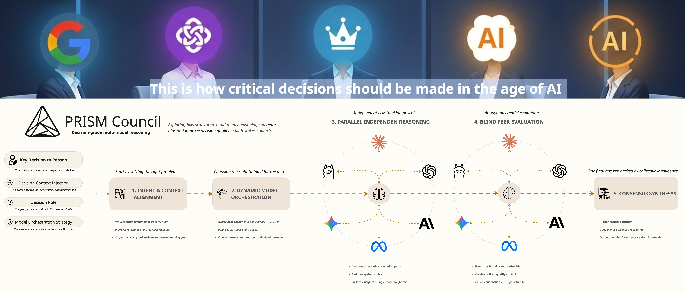

# PRISM Council

**Decision-grade multi-model reasoning**

PRISM Council is a decision-grade, multi-model reasoning system that orchestrates multiple frontier AI models into a structured deliberation and evaluation process.

🌐 **Project website:**  
https://prism-thinking-layer.lovable.app/

Instead of relying on a single LLM response, PRISM Council enables **parallel, independent reasoning across many models**, followed by **blind review and consensus synthesis** — producing outputs that are more robust, explainable, and trustworthy.

PRISM Council is a core mechanism within the broader **PRISM** framework, which focuses on **governance, orchestration, and evaluation of intelligence at scale**.

> **PRISM transforms prompting into a structured, multi-model deliberation process that delivers consensus-driven, high-confidence AI outputs.**


*Five-stage deliberation pipeline: Intent & Context Alignment → Dynamic Model Orchestration → Parallel Independent Reasoning → Blind Peer Evaluation → Consensus Synthesis*

---

## Why PRISM Council

Most AI systems answer questions by querying a single model and returning its output.

PRISM Council is designed for situations where:
- accuracy matters more than speed,
- bias must be reduced,
- reasoning quality must be compared,
- and decisions should not depend on a single model’s opinion.

Instead of asking *one model* to be right, PRISM Council asks *many models* to reason independently — and then evaluates their answers without bias.

---

## How It Works

When you submit a query, PRISM Council runs a structured, multi-stage deliberation pipeline:

### **Stage 0 — Clarification (Optional)**

If Clarification-First Mode is enabled:
- An Analyst model reviews your query for ambiguity
- Asks clarifying questions if needed
- Refines the query into a clear, actionable briefing
- Proceeds to deliberation only when the request is fully understood

### **Stage 1 — Independent Reasoning**
The same query is sent to multiple AI models in parallel.

Each model:
- reasons independently,
- has no visibility into the others,
- produces its own complete response.

All responses are preserved and can be inspected individually.

---

### **Stage 2 — Blind Review & Evaluation**
Each model is then shown the set of responses produced by the other models.

To reduce bias:
- model identities are anonymized,
- evaluations focus strictly on accuracy, clarity, and insight.

Each model critiques and ranks the responses without knowing which model authored them.

---

### **Stage 3 — Consensus Synthesis**
A designated synthesis model (the *Chairman*) aggregates:
- the original responses,
- the blind evaluations,
- and the rankings,

and produces a **single, consolidated response** that reflects the strongest reasoning rather than a single opinion.

The result is not a vote, but a **reasoned synthesis**.

---

## Features

### 🧠 Multi-Model Deliberation
- Parallel reasoning across multiple frontier models (OpenAI, Anthropic, Google, etc.)
- Blind peer review and ranking to reduce bias
- Consensus synthesis by designated Chairman model

### 💬 Conversation Management
- Multi-turn conversations with full history
- Auto-generated conversation titles
- Persistent storage with archival organization

### 🎯 Contexts & Roles
- **Contexts:** Authoritative background information that persists across conversations
- **Roles:** Behavioral perspectives that shape reasoning style
- Per-conversation assignment with snapshot preservation

### 🔍 Clarification System
- Optional interactive question refinement
- Ambiguity detection and resolution
- Analyst-driven query improvement before deliberation

### ⚙️ Dynamic Model Selection
- Browse 300+ models from OpenRouter
- Configure reasoning models, Chairman, and Analyst
- Per-conversation model overrides
- Settings-based defaults with UI configuration

### 📊 Transparent Reasoning
- Inspect individual model responses
- View peer rankings and evaluations
- Preserve intermediate reasoning stages

---

## Conversation Memory

PRISM Council maintains conversation history automatically.

Follow-up questions are evaluated in the context of prior exchanges, enabling natural multi-turn reasoning while preserving deliberative structure.

---

## Contexts (Authoritative Background)

Contexts allow you to define **stable, authoritative background information** that applies across conversations.

Contexts are:
- **Long-lived** — define once, reuse many times
- **Authoritative** — treated as fixed reference points
- **Versioned** — each conversation snapshots its context at creation time

Examples:
- professional background
- organizational constraints
- project goals
- personal principles

---

## Roles (Behavioral Perspectives)

Roles allow you to define **behavioral perspectives** that guide how the models reason and respond.

Roles are:
- **Reusable** — define once, apply to any conversation
- **Perspective-shaping** — influence reasoning style and approach
- **Independent** — can be used with or without Contexts

Examples:
- "Think like a skeptical engineer"
- "Respond as a strategic advisor"
- "Reason from first principles"

---

## Clarification System

Before running the full multi-model deliberation, PRISM can optionally:
- Ask clarifying questions to better understand your request
- Refine ambiguous queries through interactive dialogue
- Ensure the reasoning stage addresses your actual intent

This **Clarification-First Mode** can be enabled in Settings.

---

## Concept & Visual Overview

The PRISM framework and the Council mechanism are explained visually on the project website:

👉 https://prism-thinking-layer.lovable.app/

The website focuses on:
- the conceptual model behind PRISM,
- how governance and deliberation differ from simple multi-LLM querying,
- and why blind, multi-model evaluation leads to more reliable outcomes.

GitHub focuses on **implementation**.  
The website focuses on **system thinking and intent**.

---

## Screenshots

### Main Interface


*Main landing page with reasoning prompt interface*


*Starting a new reasoning session with context and role options*

### Deliberation Process


*Interactive clarification questions before reasoning begins*


*Structured brief generated from clarification responses*


*Stage 1: Parallel reasoning across multiple models*


*Reviewing independent outputs from each council member*


*Chairman-synthesized consensus response*

### Configuration


*System-wide settings for model orchestration and reasoning modes*


*Configuring reasoning models, Chairman, and Analyst*


*Creating and managing authoritative background contexts*


*Defining behavioral perspectives and reasoning styles*

---

## Relationship to LLM Council (Acknowledgement)

PRISM Council is inspired by early open-source explorations of multi-model “council” patterns, including the *LLM Council* project.

PRISM Council extends this idea by:
- formalizing blind evaluation,
- emphasizing governance and orchestration,
- and positioning deliberation as part of a broader decision-grade intelligence framework.

---

## Setup

### 1. Install Dependencies

The project uses [uv](https://docs.astral.sh/uv/) for Python project management.

**Backend:**
```bash
uv sync
```

**Frontend:**
```bash
cd frontend
npm install
cd ..
```

### 2. Configure API Key

Create a `.env` file in the project root:

```bash
OPENROUTER_API_KEY=sk-or-v1-...
```

Get your API key at [openrouter.ai](https://openrouter.ai/).

### 3. Configure Models

**Recommended:** Use the **Settings interface** in the app to:
- Browse available models from OpenRouter dynamically
- Select reasoning models (council members)
- Choose a Chairman model for synthesis
- Pick an Analyst model for clarification

**Alternative:** Edit default fallbacks in `backend/config.py`:

```python
COUNCIL_MODELS = [
    "openai/gpt-4o",
    "anthropic/claude-3.5-sonnet",
    "google/gemini-2.0-flash-exp",
]

CHAIRMAN_MODEL = "anthropic/claude-3.5-sonnet"
```

The app fetches available models from [OpenRouter](https://openrouter.ai/models) at runtime.

## Running the Application

### Option 1 — Start Script

```bash
./start.sh
```

### Option 2 — Manual

**Terminal 1 (Backend):**
```bash
uv run python -m backend.main
```

**Terminal 2 (Frontend):**
```bash
cd frontend
npm run dev
```

Open http://localhost:5173 in your browser.

## Tech Stack

- **Backend:** 
  - FastAPI (Python 3.10+)
  - async httpx for API calls
  - Pydantic for data validation
  - OpenRouter API integration
  - JSON-based storage (conversations, contexts, roles, settings)

- **Frontend:** 
  - React 19
  - Vite (dev server + build tool)
  - react-markdown for response rendering
  - Native CSS (design token system)

- **Tooling:** 
  - uv (Python dependency management)
  - npm (JavaScript dependency management)
  - ESLint (frontend linting)

## Project Structure

```
prism-council/
├── backend/               # FastAPI backend
│   ├── main.py           # API endpoints & server
│   ├── council.py        # 3-stage deliberation logic
│   ├── clarification.py  # Interactive query refinement
│   ├── model_picker.py   # Dynamic model selection
│   ├── openrouter.py     # OpenRouter API client
│   ├── storage.py        # Conversation persistence
│   ├── context_storage.py
│   ├── role_storage.py
│   ├── settings_storage.py
│   └── config.py         # Configuration & defaults
├── frontend/             # React + Vite frontend
│   ├── src/
│   │   ├── components/   # UI components
│   │   ├── api.js        # Backend API client
│   │   ├── App.jsx       # Main app component
│   │   └── index.css     # Design token system
│   └── public/           # Static assets
├── data/                 # Runtime data (gitignored)
│   ├── conversations/    # Conversation history
│   ├── contexts/         # Saved contexts
│   ├── roles/            # Saved roles
│   └── settings.json     # User settings
├── .env                  # API keys (gitignored)
├── start.sh              # Quick start script
└── pyproject.toml        # Python dependencies
```

## Project Status

PRISM Council is an experimental but structured exploration of decision-grade multi-model reasoning.

The goal is not to replace individual LLMs, but to govern how they are used when correctness, robustness, and transparency matter.

For conceptual background, system diagrams, and positioning:  
🌐 https://prism-thinking-layer.lovable.app/
